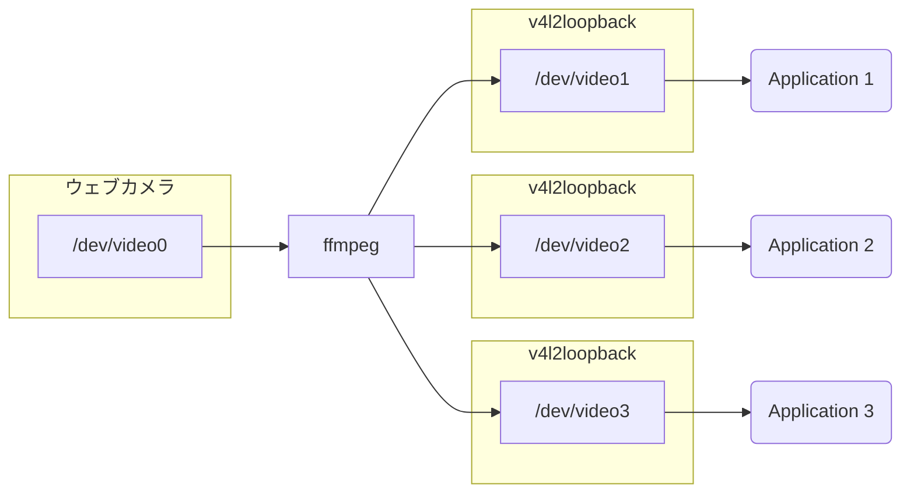

Linuxでは、通常1台のウェブカメラ（Video4Linuxデバイス）を複数のアプリケーションで同時に使うことはできません。

しかし、v4l2loopbackを使って複数の仮想ビデオデバイスを作成し、ffmpegを使って物理ビデオデバイスからの映像を仮想ビデオデバイスに流すことで、この制限を回避することができます。本記事ではその手順を紹介します。



# 1. v4l2loopbackのインストール

パッケージマネージャからインストールするか、あるいはソースコードを自身でビルドしてインストールできます。

## 1-a. パッケージマネージャでインストール

Debian等のディストリビューションではリポジトリからインストールできる場合があります。

```sh
sudo apt update
sudo apt install v4l2loopback-dkms
```

ただし、私の手元のRaspberry Pi OSではこの方法ではうまくいかず、ソースコードからインストールする必要がありました。

## 1-b. ソースコードをビルドしてインストール

v4l2loopbackのソースコードはGitHubで公開されており、手順に従うだけで簡単にビルドできます。

https://github.com/umlaeute/v4l2loopback

ますはビルドに必要なカーネルヘッダをインストールします。Debianの場合は以下のとおりです。

```sh
sudo apt update
sudo apt install linux-headers-$(uname -r)
```

Rapsberry Pi OSの場合は、代わりに`raspberrypi-kernel-headers`をインストールします。

```sh
sudo apt update
sudo apt install raspberrypi-kernel-headers
```

カーネルヘッダがインストールできたら、ソースコードをダウンロードしビルドします。ビルドは一瞬で終わります。

```sh
curl -LO https://github.com/umlaeute/v4l2loopback/archive/refs/tags/v0.12.5.tar.gz
tar xzf v0.12.5.tar.gz
cd v4l2loopback-0.12.5
make
```

ビルドに成功したら、カーネルモジュールをインストールします。

```sh
sudo make install
sudo depmod -a
```

# 2. v4l2loopbackカーネルモジュールのロード

先程インストールしたv4l2loopbackカーネルモジュールをロードすると、仮想ビデオデバイスが作成されます。このとき、`devices`オプションで作成するデバイスの数を指定できます。
ここでは3つの仮想ビデオデバイスを作成します。

```sh
sudo modprobe v4l2loopback devices=3
```

以下のコマンドでDummy video deviceが3つ作成されていることを確認してください。

```sh
v4l2-ctl --list-devices
```

オプションを変更する場合は、一度モジュールをアンロードしてから再度ロードし直す必要があります。

```sh
# カーネルモジュールをアンロード
sudo modprobe -r v4l2loopback

# デバイスを4つ作成
sudo modprobe v4l2loopback devices=4
```

なお、`video_nr`オプションで作成するデバイスIDを指定できます。例えば、`/dev/video42`、`/dev/video43`、`/dev/video44`の3つのデバイスを作成したい場合は次のようにします。

```sh
sudo modprobe v4l2loopback video_nr=42,43,44
```

デバイスIDを指定しなかった場合は空いているIDが使われるようです。以下では`/dev/video1`、`/dev/video2`、`/dev/video3`の3つのデバイスが作成されたものとして話を進めます。

# 3. ウェブカメラの映像を仮想ビデオデバイスに流す

ffmpegを使ってウェブカメラの映像を仮想ビデオデバイスに流します。ffmpegがインストールされていない場合はインストールしてください。

ウェブカメラが`/dev/video0`で、先程作成した仮想ビデオデバイスが`/dev/video1`、`/dev/video2`、`/dev/video3`のとき、以下のコマンドで映像を転送できます。

```sh
ffmpeg \
  -f video4linux2 -i /dev/video0 \
  -f video4linux2 -vcodec copy /dev/video1 \
  -f video4linux2 -vcodec copy /dev/video2 \
  -f video4linux2 -vcodec copy /dev/video3
```

これで、`/dev/video1`、`/dev/video2`、`/dev/video3`のそれぞれを通じてウェブカメラの映像に同時にアクセスできるようになりました。

なお、フォーマットや解像度、フレームレートを指定したい場合は以下のようにします。

```sh
ffmpeg \
  -f video4linux2 -input_format mjpeg -video_size 1280x720 -framerate 30 -i /dev/video0 \
  -f video4linux2 -vcodec copy /dev/video1 \
  -f video4linux2 -vcodec copy /dev/video2 \
  -f video4linux2 -vcodec copy /dev/video3
```
