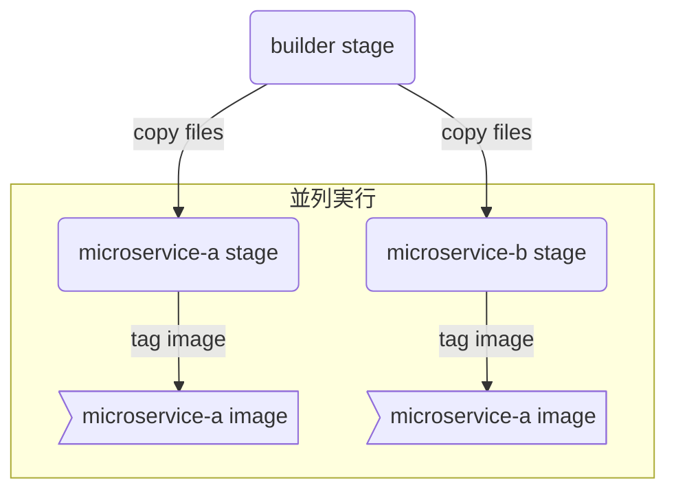
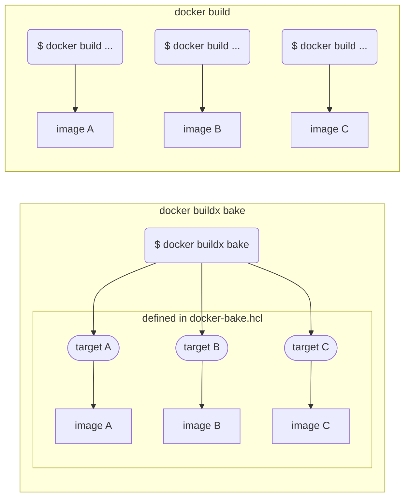

# 概要

かつて、Docker ではイメージの並列ビルドを行うことはできませんでした。2017 年に導入された multi-stage build では並列ビルドがサポートされましたが、あくまでも**一つのイメージ**をビルドする過程でステージを並列実行するというものでした。

しかし、buildx の新機能である`buildx bake`を使うと、一つのコマンドで**複数のイメージ**を同時にビルドすることができます。例えば、以下の`Dockerfile`から`microservice-a`と`microservice-b`の 2 つのイメージを出力することができます。

```dockerfile
# Microservice AとBをビルドするステージ
FROM rust as builder-stage

COPY ./src /services-src

WORKDIR /services-src
RUN cargo build --release --bins

# Microservice Aに必要なファイルだけを用意するステージ
FROM debian:bullseye-slim as microservice-a-stage

RUN apt-get update && \
    apt-get install -y service-a-dependencies && \
    rm -rf /var/lib/apt/lists/*

COPY --from=builder-stage /services-src/target/release/service-a /service-a

ENTRYPOINT ["/service-a"]

# Microservice Bに必要なファイルだけを用意するステージ
FROM debian:bullseye-slim as microservice-b-stage

RUN apt-get update && \
    apt-get install -y service-b-dependencies && \
    rm -rf /var/lib/apt/lists/*

COPY --from=builder-stage /services-src/target/release/service-b /service-b

ENTRYPOINT ["/service-b"]
```

この記事では上記の`Dockerfile`を例にとり、`buildx bake`コマンドを使って複数のイメージを並列でビルドする方法を紹介します。



:::message
`buildx bake`の仕様は確定しておらず、後方互換性のない変更が入る可能性があります。最新の情報は[リファレンス](https://github.com/docker/buildx/blob/master/docs/reference/buildx_bake.md)でご確認ください。
:::

# ビルド定義ファイル

`buildx bake`を使うには、まずビルド定義ファイルを用意する必要があります。冒頭で示した`Dockerfile`をビルドするには、以下のように`docker-bake.hcl`を書きます。

```hcl
target "microservice-a" {
  dockerfile = "Dockerfile" # Dockerfileのファイル名（デフォルト値なので省略可能）
  target = "microservice-a-stage" # ステージ名（紛らわしいが、2行上のtargetとは無関係）
  tags = ["ciffelia/microservice-a"] # イメージにつけるタグ（複数可）
}

target "microservice-b" {
  dockerfile = "Dockerfile"
  target = "microservice-b-stage"
  tags = ["ciffelia/microservice-b"]
}
```

ビルド定義ファイルでは複数の target を定義できます。target の中では、`docker build`を実行するときと同じように、イメージをビルドするオプションを指定します。
従来は、1 回の`docker build`で 1 つのイメージを作成していました。`buildx bake`では、1 つの target で 1 つのイメージを作成します。



なお、定義ファイルの記法は以下の 3 つの中から選ぶことができます。

- Docker Compose (`docker-compose.yml`の`build`セクションに書く)
- HCL (HashiCorp configuration language)
- JSON

個人的には`docker-compose.yml`の肥大化を避けたいので、ビルド定義は HCL か JSON に書くのが良いのではないかと思います。JSON を手で書くのは大変なので、この記事では HCL を採用しています。

# `buildx bake`コマンド

`buildx bake`は、予め用意しておいたビルド定義ファイルに基づいてビルドを実行するコマンドです。以下のコマンドで、先程示した`docker-bake.hcl`の`microservice-a` `microservice-b` target を実行できます。

```shell
docker buildx bake --file docker-bake.hcl microservice-a microservice-b
```

このコマンド 1 つで、`ciffelia/microservice-a`と`ciffelia/microservice-b`の 2 つのイメージが作成されます。また、3 つのステージは並列で実行されます。

# 便利な機能

ここからは、`buildx bake`を使う上で便利な機能をいくつか紹介します。

## Target options

target の中で指定できるオプションは、
`args`, `cache-from`, `cache-to`, `context`, `dockerfile`, `inherits`, `labels`, `no-cache`, `output`, `platform`, `pull`, `secrets`, `ssh`, `tags`, `target`
です。使い方は基本的に`docker buildx build`と同じです。

```hcl
target "example" {
  dockerfile = "docker/Dockerfile.webapp"
  tags = ["ciffelia/webapp"]
  cache-from = ["type=registry,ref=ciffelia/webapp"] # 事前にレジストリからキャッシュをpullする
  push = true # ビルド完了後、レジストリにpushする
}
```

## Groups

複数の target をまとめることができます。

```hcl
group "default" {
  targets = ["microservice-a", "microservice-b"]
}

target "microservice-a" {
  target = "microservice-a-stage"
  tags = ["ciffelia/microservice-a"]
}

target "microservice-b" {
  target = "microservice-b-stage"
  tags = ["ciffelia/microservice-b"]
}
```

上記のように`docker-bake.hcl`を書いて、以下のコマンドを実行すれば、`microservice-a`と`microservice-b`の 2 つの target が実行されます。

```shell
docker buildx bake --file docker-bake.hcl default
```

なお、実行したい target や group の名前が`default`の場合は省略することができます。

```shell
# 同じ結果が得られる
docker buildx bake --file docker-bake.hcl
```

## 継承

`inherits`を使うと、既存の target をもとに新しい target を作成することができます。

```hcl
target "microservice-a" {
  target = "microservice-a-stage"
  tags = ["ciffelia/microservice-a"]
}

target "microservice-a-multiarch" {
  inherits = ["microservice-a"]
  platforms = ["linux/amd64", "linux/arm64/v8", "linux/arm/v7"]
}
```

## 複数の Dockerfile

1 つの`docker-bake.hcl`で複数の`Dockerfile`を使うことができます。当然、並列でビルドされます。

```hcl
target "frontend" {
  dockerfile = "docker/Dockerfile.frontend"
  tags = ["ciffelia/my-frontend"]
}

target "backend" {
  dockerfile = "docker/Dockerfile.backend"
  tags = ["ciffelia/my-backend"]
}
```

## GitHub Action

`buildx bake`を実行する GitHub Action が、Docker 公式でリリースされています。
https://github.com/docker/bake-action

# Reference

- [High-level build options](https://github.com/docker/buildx#high-level-build-options)
- [buildx bake](https://github.com/docker/buildx/blob/master/docs/reference/buildx_bake.md)
